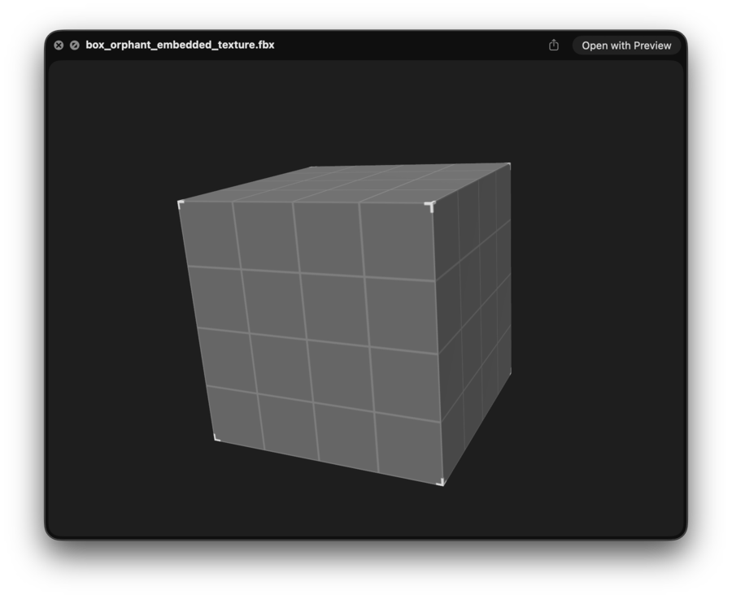
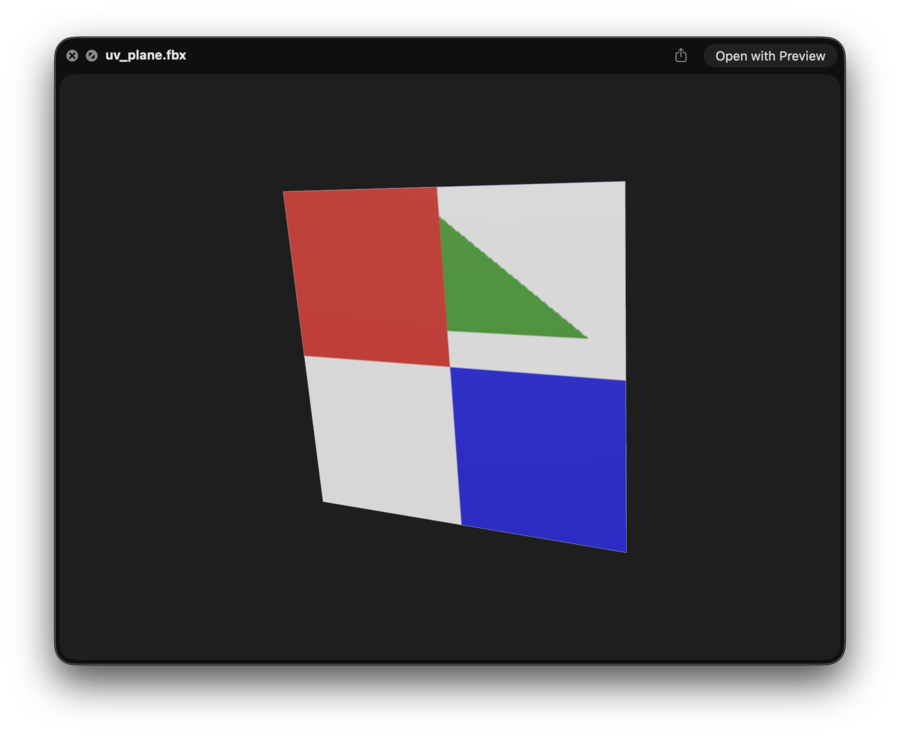
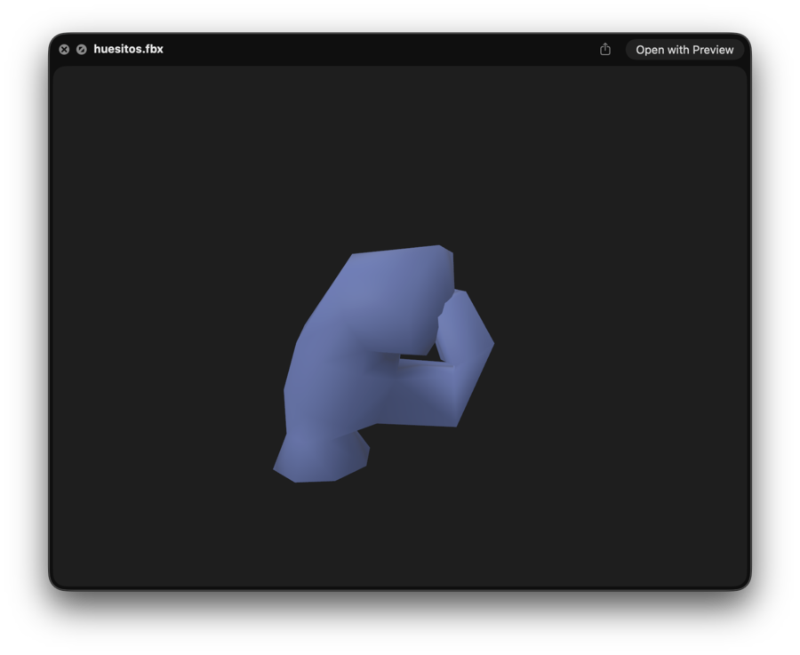
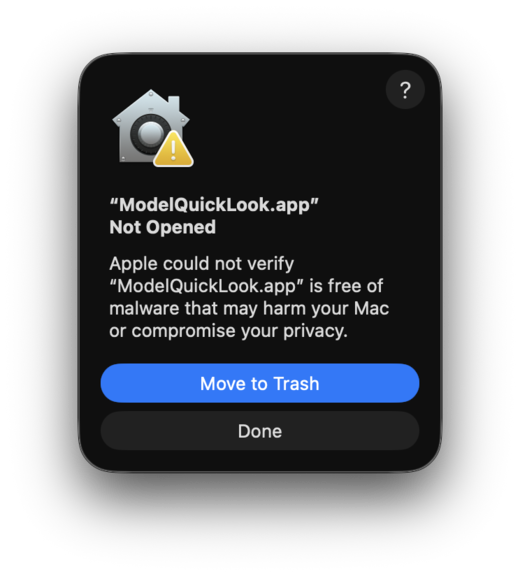

# ModelQuickLook

**Quick Look for FBX files on macOS.** Select an `.fbx` in Finder, press <kbd>Space</kbd>, and get an interactive 3D preview, the same way macOS already previews USDZ, OBJ and DAE.

<p align="center">
  
  
  
</p>

## Features

- Binary and ASCII FBX (all versions [ufbx](https://github.com/ufbx/ufbx) supports)
- Orbit, pan and zoom with the mouse or trackpad
- Materials and textures: base color, normal, metalness/roughness, emission, ambient occlusion (embedded textures and image files next to the model)
- Skinned characters, with the animation played on a loop
- Units and axes normalized (Y-up, meters), camera auto-framed to the model
- Readable error message for corrupt or oversized files

## Install

> [!NOTE]
> The app is **not notarized** because that requires a paid Apple Developer account. macOS Gatekeeper will block a downloaded copy with *"Apple could not verify ModelQuickLook.app is free of malware"* until you allow it (step 2). Building from source avoids this.

### Download

1. Download `ModelQuickLook.zip` from the [latest release](../../releases/latest), unzip it, and move `ModelQuickLook.app` to `/Applications`.
2. Allow the app. The first time you open it, macOS shows this warning (click **Done**, not *Move to Trash*):

   <p align="center"></p>

   Then use either option:
   - **Terminal:** clear the quarantine flag, then open the app.
     ```sh
     xattr -dr com.apple.quarantine /Applications/ModelQuickLook.app
     ```
   - **System Settings:** after dismissing the warning, go to **System Settings → Privacy & Security**, scroll down to the message about ModelQuickLook, and click **Open Anyway**.
3. Open the app once so macOS registers the extension.
4. If Space on an `.fbx` still shows the generic icon, enable **FBXPreview** in **System Settings → General → Login Items & Extensions → Quick Look**, then run `qlmanage -r && qlmanage -r cache`.

### Build from source

Requires Xcode and [XcodeGen](https://github.com/yonaskolb/XcodeGen) (`brew install xcodegen`).

```sh
scripts/build-release.sh   # ad-hoc-signed build, zipped to dist/ModelQuickLook.zip
scripts/install.sh         # copy to /Applications and register the extension
```

## Development

```sh
xcodegen generate
xcodebuild test -scheme ModelQuickLook -derivedDataPath build
```

| Path | What |
| --- | --- |
| `Shared/FBXSceneBuilder.swift` | ufbx scene → SceneKit: geometry, materials, skinning, animation |
| `Shared/SceneFraming.swift` | camera placement |
| `PreviewExtension/` | the Quick Look preview extension |
| `Tests/` | XCTest suite; fixtures in `Tests/Fixtures/` |

Set `TEST_RUNNER_SNAPSHOT_DIR=/some/dir` when running tests to write a PNG render of every fixture there. Larger third-party models (for example Mixamo characters) go in `Samples/`, which is git-ignored.

## Known limitations

- **No Finder thumbnails.** A thumbnail extension works for custom file types, but macOS never calls it for `.fbx` (the type is built into macOS), so Finder keeps the generic icon.
- Opacity textures, UV transforms, secondary UV sets and blend shapes are not mapped.
- Models over 5 million triangles are refused.
- Textures are only found next to the model file; missing ones render gray. To read them, the extension's sandbox has a read-only exception for `/Users/` and `/Volumes/`, so models stored elsewhere only show embedded textures.
- A vertex follows at most its four strongest bones.

## Credits and license

Built on [ufbx](https://github.com/ufbx/ufbx) (public domain / MIT, vendored in `Shared/ufbx/`). Test fixtures come from the [Assimp](https://github.com/assimp/assimp) (BSD) and ufbx test data.

License: [MIT](LICENSE).
